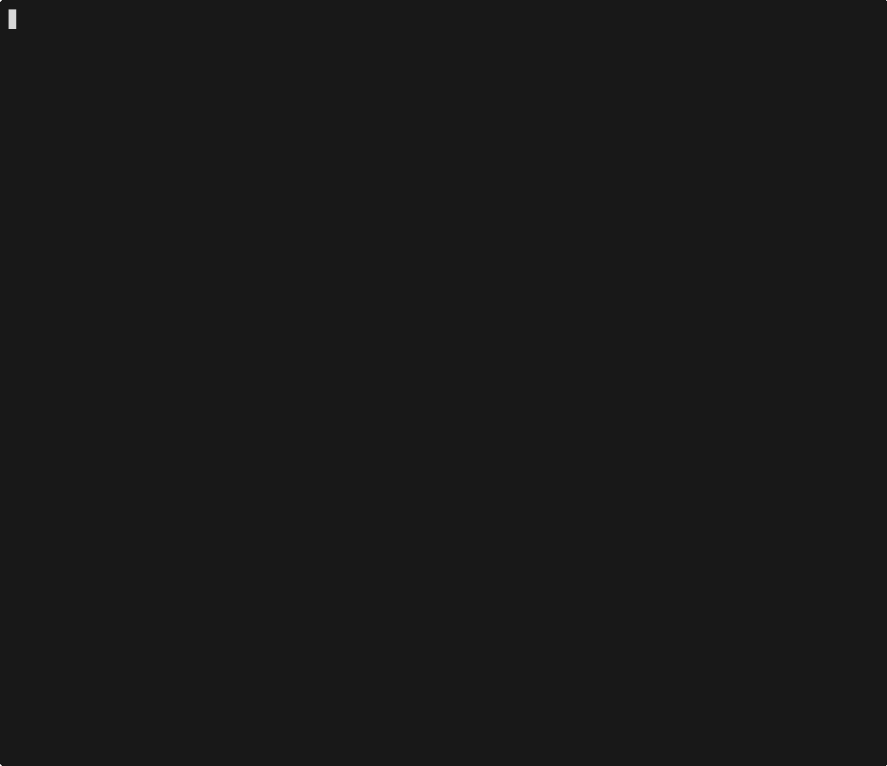

# gijq

Interactive jq explorer for the terminal. Type a filter, see results instantly.



```
gijq data.json
```

```
cat data.json | gijq
```

## Features

- **Live filtering** -- results update as you type any valid jq expression
- **Tab completion** -- press Tab to cycle through available keys at the current path, works through nested objects, arrays, and pipe expressions
- **Split-pane layout** -- JSON output on the left, available keys on the right
- **Query history** -- per-file history accessible via Ctrl+H, persisted across sessions
- **Clipboard support** -- copy output or filter to clipboard, with OSC52 fallback for SSH sessions
- **Syntax highlighting** -- keys, strings, numbers, booleans, and nulls are color-coded
- **Scrollable output** -- arrow keys and page up/down for large results
- **Pipeline-friendly** -- press Enter to output the current result to stdout and exit

## Install

Requires Go 1.24+.

```
go install github.com/dayangraham/gijq@latest
```

Or build from source:

```
git clone https://github.com/dayangraham/gijq.git
cd gijq
go build -o gijq .
```

## Releases

This repo includes a GitHub Actions release workflow at `.github/workflows/release.yml`.
It runs `go test ./...`, builds binaries for Linux/macOS/Windows, and uploads them to a GitHub Release on each push to `main`.

Release tags are generated automatically in this format:

```text
main-<run-number>-<short-sha>
```

After pushing to `main`, check the Actions tab, then see the assets on the new release page.

## Usage

```sh
# From a file
gijq api-response.json

# From a pipe
curl -s https://api.example.com/data | gijq
```

Once inside, type any jq expression in the filter bar:

```
.users[] | select(.active) | .name
```

## Keybindings

| Key | Action |
|---|---|
| *type* | Filter updates, results refresh live |
| `Tab` | Cycle autocomplete suggestions |
| `Enter` | Output current result to stdout and exit |
| `Ctrl+Y` | Copy JSON output to clipboard |
| `Ctrl+F` | Copy filter to clipboard |
| `Ctrl+H` | Show query history overlay |
| `Up/Down` | Scroll output or navigate suggestions |
| `PgUp/PgDn` | Scroll output half-page |
| `Esc` | Close overlay, or exit |
| `Ctrl+C` | Exit |

## License

MIT
